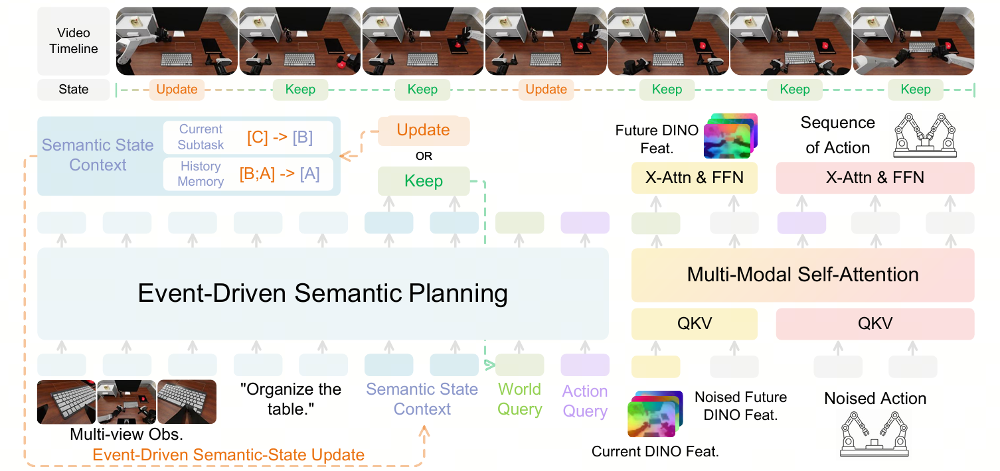
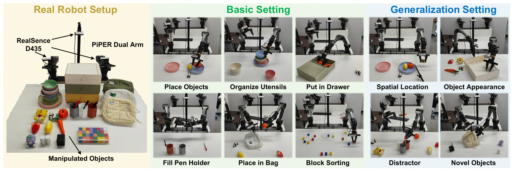

<div align="center">
<h1>CogWAM</h1>
<p><b>Cognition-Guided World-Action Model with a Persistent Semantic State</b></p>

<a href="#-citation"></a>
<a href="#-released-checkpoint"></a>
<a href="LICENSE"></a>
</div>

## 📖 Abstract

Robot policies increasingly incorporate semantic reasoning and future-world
prediction, yet combining these capabilities does not guarantee that local
predictions and actions remain aligned with task progress. We introduce
**CogWAM**, a cognition-guided world-action model that establishes an explicit
semantic interface between task reasoning and world-action learning through a
persistent **Semantic State**, which stores completed task events and the active
subtask. CogWAM updates this state only when observations indicate semantic
transitions, allowing task-level context to persist across multiple action
chunks. To bridge semantic context with physical prediction and control, CogWAM
employs progress-conditioned **WORLD** and **ACTION** queries that selectively
extract task-relevant information for future-world prediction and action
generation. During training, the Semantic State provides shared task-progress
context for both branches, while inference removes the future-prediction branch
and directly generates actions from observations and the maintained state.
Without additional robot-action pre-training, CogWAM reaches **15.56 / 11.70**
Score/SR on RoboDojo.

> **Scope of this repository.** This is the reproduction release for the
> **RoboDojo** experiment: one frozen recipe, end to end — data contract,
> training, checkpoint release, policy serving, and evaluation. The BiCoord and
> real-world experiments in the paper are not part of this release.

<div align="center">

</div>

An event-triggered `KEEP`/`UPDATE` mechanism maintains the Semantic State during
closed-loop execution. WORLD and ACTION queries condition parallel branches for
future multi-view DINO feature prediction and continuous action generation.

## ⭐ Key Features

* 🧠 **Event-Triggered Semantic State.** A persistent `(completed events, active subtask)`
  pair that the model rewrites *only* when it emits `<UPDATE>`. A `<KEEP>` costs one
  forward pass and no autoregressive generation, so semantic context survives across
  many action chunks instead of being regenerated on a clock.
* 🎯 **Progress-Conditioned World–Action Interface.** Two sets of learnable query
  tokens appended after the observation, instruction and Semantic State. Their hidden
  states route to different objectives — WORLD to future-latent prediction, ACTION to
  control — so both branches share task-level semantics while keeping
  objective-specific representations.
* ⚖️ **Boundary-Aware Semantic Sampling.** Semantic transitions are sparse (6.4% of
  decision points). Each semantic batch is 2 `UPDATE` + 2 *hard* `KEEP` (the decision
  points adjacent to a transition) + 2 random `KEEP`, which forces the model to
  localise transitions rather than learn the prior.

## 📦 Repository Contents

```
CogWAM/
├── cogwam/
│   ├── models/
│   │   ├── cogwam.py               # the framework: planner, queries, KEEP/UPDATE objective
│   │   ├── world_action_mot.py     # causal DINO MoT: world + action streams
│   │   ├── vlm_interface.py        # RynnBrain1.1 / Qwen3.5 backbone wrapper
│   │   ├── dino_v3.py              # frozen DINOv3 encoder, multi-layer fusion
│   │   └── base.py                 # framework base class and build_model
│   ├── data/
│   │   ├── dataset.py              # RoboDojo LeRobot v2.1 loader
│   │   ├── event_memory.py         # Semantic State labels, index, boundary-aware sampler
│   │   ├── composite.py            # tri-view composite (shared by trainer and server)
│   │   ├── robodojo.py             # the single data configuration
│   │   └── lerobot/                # pruned LeRobot v2.1 reader and transforms
│   ├── training/                   # entry point, dual-stream trainer, optimizer, checkpoints
│   ├── serve/                      # stateless WebSocket policy server
│   ├── eval/                       # RoboDojo adapter, rollout, Table-1 aggregation
│   └── recipe.py                   # the frozen reproduction contract + fingerprint
├── configs/
│   ├── cogwam_robodojo_h25_eventmem_dino_multilayer_50k.yaml
│   ├── accelerate/zero2.yaml  deepspeed/zero2.json  robodojo_deploy.yml
├── scripts/                        # train_multi_node.sh, serve_policy.sh, eval_robodojo.sh
├── tools/                          # convert_checkpoint.py, verify_checkpoint.py, label_subtasks.py
└── UPSTREAM_SOURCES.json           # per-file provenance for every ported file
```

## 🛠️ Installation

Two environments are required and **cannot be merged**: training pins
`transformers` 5.x on Python 3.12, while the RoboDojo simulator pins Isaac Sim on
Python 3.11. They talk over a WebSocket, so they never share an interpreter and
may sit on different machines.

### Training and serving

```bash
conda create -n cogwam python=3.12 -y && conda activate cogwam
pip install torch==2.6.0 torchvision==0.21.0 --index-url https://download.pytorch.org/whl/cu124
pip install -r requirements.txt
pip install flash-attn==2.7.4.post1 --no-build-isolation   # optional; the recipe uses SDPA
pip install -e .
```

| Component | Version | Why pinned |
|---|---|---|
| Python | 3.12 (3.10+ works) | reference image |
| torch / torchvision | 2.6.0+cu124 / 0.21.0 | see *Known gaps* |
| **transformers** | **>= 5.2.0** | first release exposing `Qwen3_5ForConditionalGeneration`; 4.x cannot load the backbone at all |
| **flash-linear-attention** | **0.3.2** | not optional — RynnBrain1.1 interleaves three `linear_attention` layers per full-attention layer; later releases change numerics |
| **causal_conv1d** | **1.5.0.post8** | required by the same layers |
| triton | 3.2.0 | matches those two kernels |
| deepspeed / accelerate | 0.16.9 / 1.5.2 | ZeRO-2, bf16 |
| numpy / av / decord / pyarrow | 1.26.4 / 12.3.0 / 0.6.0 / 14.0.1 | data path |

### Evaluation client

```bash
git clone --recurse-submodules https://github.com/RoboDojo-Benchmark/RoboDojo.git
cd RoboDojo && git checkout 9b4cc885e8f530ed3ab14a30a312ae70242771c4
git submodule update --init --recursive
export ROBODOJO_ROOT="$PWD"
pip install -r /path/to/CogWAM/requirements-eval.txt
```

| Component | Pin |
|---|---|
| RoboDojo | **0.2.0** @ `9b4cc885e8f530ed3ab14a30a312ae70242771c4` |
| `XPolicyLab` | `fe71eb54675cef495fea817a637386a4f4529153` |
| `third_party/IsaacLab` | `afca7b09d60d8beb9c1cb28b43066499940b969b` |
| `third_party/curobo` | `d17b54ce32cba095c0b000c4c58777075d11de0e` (`isaacsim-warp18`) |
| Isaac Sim / Python / CUDA | 5.1 / 3.11 / 12.8 |


## 🚀 Quick Start

```bash
export COGWAM_BASE_VLM=/models/rynnbrain1.1-2B
export COGWAM_DINO_MODEL=/models/dinov3-vitb16
export COGWAM_DATA_ROOT=/datasets/RoboDojo
export COGWAM_RUN_ROOT=/outputs/cogwam

# 8 nodes x 8 GPUs; set the rendezvous vars on each node
export COGWAM_MAIN_PROCESS_IP=<rank-0 address> COGWAM_NUM_MACHINES=8 COGWAM_MACHINE_RANK=<0..7>
bash scripts/train_multi_node.sh configs/cogwam_robodojo_h25_eventmem_dino_multilayer_50k.yaml
```

Single-GPU smoke test (this is deliberately *not* a reproduction, so the recipe
contract must be waived):

```bash
COGWAM_SKIP_RECIPE_VALIDATION=1 python -m cogwam.training.train \
  --config_yaml configs/cogwam_robodojo_h25_eventmem_dino_multilayer_50k.yaml \
  --trainer.max_train_steps=10 --datasets.vla_data.per_device_batch_size=1
```

## 🤖 Model

| | |
|---|---|
| VLM | RynnBrain1.1-2B (Qwen3.5), hidden 2048, SDPA, BF16 |
| Queries | 16 WORLD + 25 ACTION (must equal the action horizon) |
| Physical model | causal DINO MoT, 30 layers, 24 heads × 128; world stream 512/2048, action stream 1024/4096 |
| Visual latents | frozen DINOv3 ViT-B/16, layers `[2, 5, 8, 11]` mean-fused, 24×20 patches pooled to a 12×10 / 120-token grid, future frame at `t + 16` |
| Action | 14-D absolute joint positions, horizon 25, flow matching, 20 Euler steps at inference |
| Semantic State | `event_driven_memory_ntp`, decision every 10 steps, loss weight 0.005 |
| Optimisation | ZeRO-2 bf16, global batch 768, 50k steps, 2k warmup, cosine to 5e-7 |

The multi-layer DINO fusion applies to **both** the clean current prefix and the
future denoising target — they share one `world_input` projection, so a target
drawn from one feature space and a prefix from another would make the objective
incoherent. Every weight shape is identical to the single-layer variant.

### The frozen recipe

`cogwam/recipe.py` compares 162 dotted config paths against a frozen contract
and raises before the backbones load, then emits a SHA-256 fingerprint written
next to the run. Storage locations are deliberately *not* frozen — upstream
enforced absolute paths, which made the recipe unrunnable elsewhere.

## 📊 Data

Training uses the RoboDojo demonstration corpus in **LeRobot v2.1** format
(3,500 episodes / 1,859,602 frames). Three cameras (`cam_high`,
`cam_left_wrist`, `cam_right_wrist`) are stitched into one `tri_view_composite`
image; actions are 14-D absolute joint positions.

### Semantic State annotations

Two extra per-frame columns supervise the entire semantic objective:

| Column | Meaning |
|---|---|
| `subtask_text` | the subtask **in progress** at this frame |
| `complete_text` | the events **already finished**, joined as `". ".join(items) + "."`, or `None.` |

Both are piecewise constant over right-open spans and **flip on the same frame**;
neither may ever be empty. Everything else is derived at load time: at a decision
frame `t`, the loader reads `t` and `t-10` and emits `semantic_memory`,
`cached_current_subtask`, `semantic_decision`, `memory_add` and
`semantic_cache_valid`. "Changed" is judged under N1 normalisation (collapse
whitespace, casefold, strip trailing `.;,:!?`), so re-punctuation does not
manufacture a spurious `UPDATE`.

**The guard that matters:** only **6.4%** of decision points are `UPDATE`s, and
that ratio is a contract, not an observation. The first launch builds
`semantic_index_v1.npz` and refuses to continue outside `0.064 ± 0.005` — below
the band the semantic head learns to always answer `KEEP`; above it, the
event-driven premise is gone. Widening the tolerance to make a run start is how
the objective silently becomes a different objective.

To validate a dataset, or to annotate your own:

```bash
python tools/label_subtasks.py --dataset-root "$COGWAM_DATA_ROOT" --check
```

`--check` makes no model calls. Labelling needs an OpenAI-compatible endpoint via
`COGWAM_LABEL_BASE_URL` / `COGWAM_LABEL_MODEL` / `COGWAM_LABEL_API_KEY`, plus a
checklist file giving the ordered subtask strings per task — the model only
decides *where* the boundaries fall, which keeps the subtask vocabulary stable
across episodes. The checklists used for the released annotations are not part of
this release; re-labelling will produce your own segmentation, and the ratio
guard is how you tell whether it is in family.

## 🏋️ Training & Evaluation

### RoboDojo — Simulated Bimanual Manipulation

Evaluation splits across two processes: a **stateless** policy server holding the
model, and the Isaac Sim client holding all per-environment Semantic State. That
split is the contract — the server cannot leak state between episodes because it
has none.

```bash
# machine A (GPUs): N servers on ports 7777.., blocks until every handshake, prints its address
COGWAM_ARTIFACT_DIR=/ckpts/cogwam-robodojo-h25-50k NUM_SERVERS=8 bash scripts/serve_policy.sh

# machine B (Isaac Sim)
export ROBODOJO_ROOT=/path/to/RoboDojo ROBODOJO_PYTHON=/opt/robodojo-env/bin/python
export COGWAM_CKPT_PATH=/ckpts/cogwam-robodojo-h25-50k COGWAM_POLICY_HOST=<address from A>
bash scripts/eval_robodojo.sh

python -m cogwam.eval.summarize --eval-root <rollout dir> \
  --checkpoint /ckpts/cogwam-robodojo-h25-50k --ckpt-name cogwam-robodojo-h25-50k --seed 0
```

Protocol: **42 tasks** in 5 dimensions (Generalization 12, Precision 8,
Long-Horizon 8, Memory 6, Open 8), **54 eval configs** (the 12 Generalization
tasks run twice, `<task>` and `<task>_random`, 25 episodes each; the other 30 run
50), **2100 episodes per seed**. Aggregation is equal-weight at every level, so
Memory's 6 tasks weigh as much as Generalization's 12. Episodes flagged
`unstable` leave the denominator. The public leaderboard protocol uses **3 seeds**
(6300 episodes); a single-seed number is one third of that sample size.

Control semantics: the model predicts a **25-step** chunk, of which only the
first **10** are executed before replanning; the 15-step tail is RTC overlap and
is discarded (`RTC_ENABLED` is false in the released configuration). A semantic
`KEEP`/`UPDATE` decision fires on exactly the same tick — the client aborts
unless the server advertises `event_replan_interval == 10` and
`event_semantic_offset == -10`.

Results as reported in the paper. CogWAM uses **no prior embodied robot-data
pre-training**, so the comparable group is the lower block:

| Method | Generalization | Precision | Long-Horizon | Memory | Open | **Average** |
|---|---|---|---|---|---|---|
| Fast-WAM | 2.34 / 1.00 | 1.96 / 0.00 | 9.14 / 5.17 | 3.55 / 3.44 | 0.42 / 0.42 | 3.48 / 2.03 |
| AHA-WAM | 5.79 / 3.00 | 5.86 / 2.42 | 8.61 / 2.67 | 2.97 / 2.78 | 0.88 / 0.83 | 4.82 / 2.39 |
| StarVLA-α | 3.94 / 2.50 | 9.90 / 4.33 | 14.15 / 6.50 | 3.34 / 2.44 | 0.68 / 0.58 | 6.40 / 3.24 |
| X-WAM | 7.39 / 3.00 | 6.72 / 1.83 | 17.47 / 9.08 | 6.32 / 4.67 | 0.57 / 0.25 | 7.69 / 3.83 |
| Fast-WAM + CogWAM Interface | 12.28 / 9.00 | 19.61 / 13.50 | 23.69 / 14.75 | **9.17 / 8.00** | 1.93 / 1.75 | 13.33 / 9.40 |
| **CogWAM (ours)** | **15.53 / 12.17** | **24.45 / 19.00** | **28.14 / 19.00** | 7.65 / 6.33 | **2.05 / 2.00** | **15.56 / 11.70** |

Each cell is Score / Success Rate (%). A full single-seed sweep is roughly 30
hours with 8 GPUs per side.

### Real-world deployment

The paper also evaluates closed-loop dual-arm manipulation on a PiPER dual-arm
rig with three RealSense D435 cameras, across basic and generalization settings
(spatial location, object appearance, distractors, novel objects) — reporting
**16.4× fewer Semantic State regenerations** than step-wise updating.

<div align="center">

</div>

**Those experiments are not part of this release.** The code here targets
RoboDojo; the real-robot stack, its data and its checkpoints are separate.

## 📚 Citation

```bibtex
@inproceedings{cogwam,
  title     = {CogWAM: Cognition-Guided World-Action Modeling with a Persistent Semantic State},
  booktitle = {International Conference on Learning Representations (ICLR)},
  year      = {2027}
}
```

## 🙏 Acknowledgements

CogWAM stands on work we did not do.

* **[StarVLA](https://github.com/starVLA/starVLA)** — this codebase is derived from
  the StarVLA research platform; its modular framework/dataloader/trainer separation
  is what made extracting a single recipe into a standalone repository tractable.
  Per-file provenance, with the upstream SHA-256 each file was ported from and every
  deviation we introduced, is in [`UPSTREAM_SOURCES.json`](UPSTREAM_SOURCES.json).
* **[RoboDojo](https://github.com/RoboDojo-Benchmark/RoboDojo)** — the benchmark,
  its task suite and evaluation protocol, and **XPolicyLab** for the policy interface.
* **RynnBrain1.1** (Alibaba DAMO Academy) — the vision-language backbone.
* **[DINOv3](https://github.com/facebookresearch/dinov3)** (Meta AI) — the frozen
  visual encoder behind both the current prefix and the future target.
* **NVIDIA Isaac Lab / Isaac Sim** and **cuRobo**, which RoboDojo builds on, and the
  **LeRobot** dataset format with its GR00T-lineage reader.

## 📄 License

MIT, with portions derived from StarVLA (MIT) — see [LICENSE](LICENSE). The two
backbone models carry their own terms and are not redistributed here.
